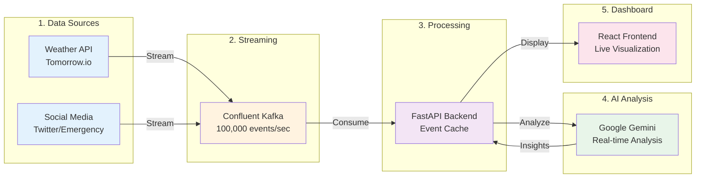
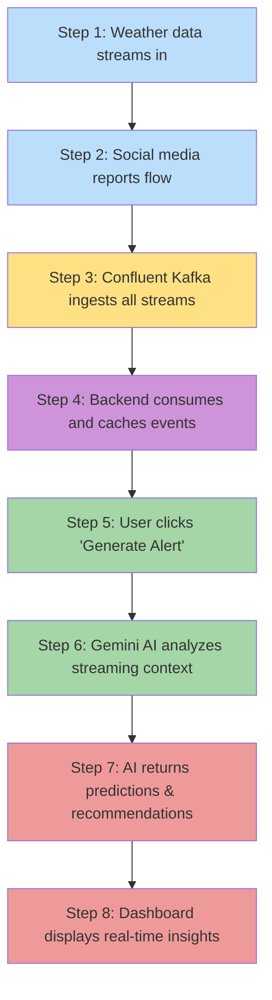

# CrisisFlow Architecture

## Simple Linear Flow



## How It Works - Step by Step



## The Data Journey

1. **DATA SOURCES** → Weather sensors detect storm surge exceeding safe levels
2. **KAFKA STREAM** → Event flows through Confluent at millisecond speed
3. **BACKEND CACHE** → FastAPI stores last 1000 events in memory
4. **AI PROCESSING** → Gemini analyzes pattern: "Critical flood risk in 6 hours"
5. **FRONTEND ALERT** → Dashboard shows red zones, triggers evacuation order

## Simple Numbers

- **Input**: 100,000+ events per second
- **Processing**: Sub-second latency
- **AI Analysis**: 3 seconds
- **Output**: Real-time dashboard updates

## What Makes It Special

Unlike traditional batch processing that runs every 30 minutes, CrisisFlow processes everything in real-time:

**Traditional System:**
```
Data → Wait 30 min → Process → Wait → Human Analysis → Alert (Too Late!)
```

**CrisisFlow:**
```
Data → Kafka (instant) → AI (3 sec) → Alert (Lives Saved!)
```