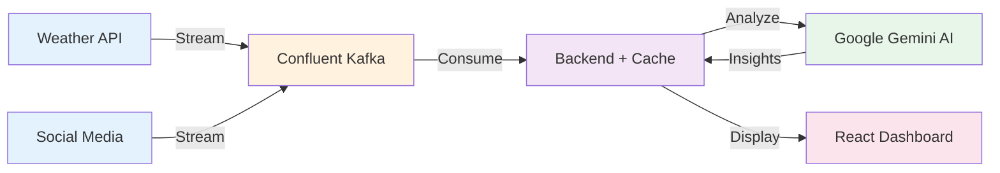

# 🚨 CrisisFlow - Real-time AI-Powered Disaster Intelligence Platform

**Confluent Challenge Submission** - AI Partner Catalyst Hackathon 2024

🏆 **Unleashing the power of AI on data in motion to save lives!**

**Live Demo:** https://crisisflow-frontend-298461721433.us-central1.run.app
**Backend API:** https://crisisflow-backend-298461721433.us-central1.run.app/api

## 🎯 What is CrisisFlow?

CrisisFlow is a real-time disaster monitoring system that:
- **Streams** fire risk, flood risk, and weather data from Tomorrow.io
- **Processes** everything through Confluent Kafka and ksqlDB
- **Synthesizes** actionable alerts using Google Gemini AI
- **Visualizes** hotspots and risks on an interactive map

When disasters strike, **minutes matter**. CrisisFlow helps emergency responders see the next hotspot before the first 911 call.

## 🏗️ Architecture

### Simple Linear Flow



**The Flow:**
1. **Data Sources** → Real-time weather and social media data
2. **Confluent Kafka** → Streams 100,000+ events/second
3. **Backend** → FastAPI caches and processes events
4. **Gemini AI** → Analyzes patterns in 3 seconds
5. **Dashboard** → Shows predictions and alerts in real-time

## 🚀 Quick Start

### Prerequisites
- Python 3.8+
- Node.js 16+
- Confluent Cloud account
- Tomorrow.io API key
- Google Gemini API key

### 1. Clone and Setup

```bash
git clone https://github.com/yourusername/crisisflow.git
cd crisisflow

# Copy environment file and add your credentials
cp .env.example .env
# Edit .env with your API keys
```

### 2. Set up Confluent Cloud

1. Log into [Confluent Cloud](https://confluent.cloud)
2. Note your bootstrap server URL from cluster settings
3. Update `CONFLUENT_BOOTSTRAP_SERVERS` in `.env`
4. Create these topics:
   - `weather_risks` (3 partitions)
   - `social_signals` (3 partitions)

### 3. Start the Producers

```bash
# Terminal 1: Weather Producer
cd producers
python -m venv venv
source venv/bin/activate  # On Windows: venv\Scripts\activate
pip install -r requirements.txt
python weather_producer.py

# Terminal 2: Social Producer
cd producers
source venv/bin/activate  # On Windows: venv\Scripts\activate
python social_producer.py
```

### 4. Set up ksqlDB (in Confluent Cloud)

1. Go to your cluster's ksqlDB interface
2. Copy and run the queries from `ksqldb/queries.sql`
3. Verify streams are created: `SHOW STREAMS;`
4. Verify tables are created: `SHOW TABLES;`

### 5. Start the Backend

```bash
# Terminal 3: FastAPI Backend
cd backend
python -m venv venv
source venv/bin/activate  # On Windows: venv\Scripts\activate
pip install -r requirements.txt
uvicorn main:app --reload --port 8000
```

### 6. Start the Frontend

```bash
# Terminal 4: React Frontend
cd frontend
npm install
npm run dev
```

Open http://localhost:5173 to see the dashboard!

## 📊 Features

### Real-time Risk Monitoring
- **Fire Risk Index** (0-100): Based on temperature, humidity, wind
- **Flood Risk Index** (0-100): Based on precipitation, soil moisture
- **Combined Risk Level**: critical, high, moderate, low

### Interactive Map
- 🔥 Red markers: Fire risk areas
- 🌊 Blue markers: Flood risk areas
- 📱 Orange markers: Social media reports
- Grid cells show aggregated hotspots

### AI-Powered Alerts
- Gemini AI synthesizes all data streams
- Generates situation reports in plain English
- Recommends specific actions for responders
- Updates every 30 minutes or on-demand

### Live Statistics
- Active fire/flood risks by severity
- Social media report counts
- Critical hotspot tracking
- Real-time event stream

## 🔧 Configuration

### Environment Variables

```bash
# Tomorrow.io (Weather Data)
TOMORROW_API_KEY=your_key_here

# Confluent Cloud (Streaming)
CONFLUENT_BOOTSTRAP_SERVERS=pkc-xxxxx.region.provider.confluent.cloud:9092
CONFLUENT_API_KEY=your_key_here
CONFLUENT_API_SECRET=your_secret_here

# Google Gemini (AI)
GOOGLE_API_KEY=your_key_here

# Application Settings
POLL_INTERVAL_SECONDS=900  # 15 minutes
LOCATIONS='[{"name": "Houston", "lat": 29.7604, "lon": -95.3698}]'
```

### Monitored Locations

By default, CrisisFlow monitors:
- Houston, TX (flood-prone)
- Miami, FL (hurricanes)
- Los Angeles, CA (fires)

Add more in `.env` (watch API rate limits).

## 📁 Project Structure

```
crisisflow/
├── producers/           # Data ingestion
│   ├── weather_producer.py
│   ├── social_producer.py
│   └── data/crisis_tweets.json
├── backend/            # FastAPI server
│   ├── main.py
│   ├── kafka_consumer.py
│   └── gemini_client.py
├── frontend/           # React dashboard
│   └── src/
│       ├── components/Map.jsx
│       └── components/AlertPanel.jsx
├── ksqldb/            # Stream processing
│   └── queries.sql
└── scripts/           # Deployment helpers
```

## 🧪 Testing

### Test Weather Producer
```bash
cd producers
python -c "from weather_producer import WeatherProducer; p = WeatherProducer(); p.run_once()"
```

### Test API Endpoints
```bash
# Health check
curl http://localhost:8000/api/health

# Get latest events
curl http://localhost:8000/api/events

# Generate AI alert
curl -X POST http://localhost:8000/api/alert/generate
```

### Verify Kafka Topics
In Confluent Cloud UI, check:
- Messages flowing in `weather_risks` topic
- Messages flowing in `social_signals` topic
- ksqlDB tables updating

## 🚀 Deployment

### Backend (Google Cloud Run)
```bash
cd backend
gcloud builds submit --tag gcr.io/PROJECT_ID/crisisflow-api
gcloud run deploy crisisflow-api --image gcr.io/PROJECT_ID/crisisflow-api --platform managed
```

### Frontend (Vercel)
```bash
cd frontend
npm run build
vercel --prod
```

## 📈 Monitoring

### Confluent Cloud Metrics
- Message throughput
- Consumer lag
- ksqlDB query performance

### Application Metrics
- API response times
- Gemini API usage
- Tomorrow.io API calls remaining

## 🐛 Troubleshooting

### No data showing?
1. Check producers are running: Look for log output
2. Verify Kafka connection: Check Confluent Cloud UI
3. Ensure topics exist: `weather_risks`, `social_signals`

### API errors?
1. Verify all API keys in `.env`
2. Check rate limits (Tomorrow.io: 500/day free)
3. Look at backend logs for detailed errors

### Map not updating?
1. Check browser console for errors
2. Verify backend is running: http://localhost:8000/api/health
3. Check CORS settings if deployed

## 🤝 Contributing

1. Fork the repository
2. Create a feature branch
3. Make your changes
4. Submit a pull request

## 📄 License

MIT License - See LICENSE file

## 🙏 Acknowledgments

- **Confluent** for Kafka Cloud infrastructure
- **Google** for Gemini AI
- **Tomorrow.io** for weather data
- **CrisisNLP** for disaster tweet patterns

---

**Built with ❤️ for emergency responders worldwide**

*CrisisFlow - Because when disasters strike, minutes matter.*